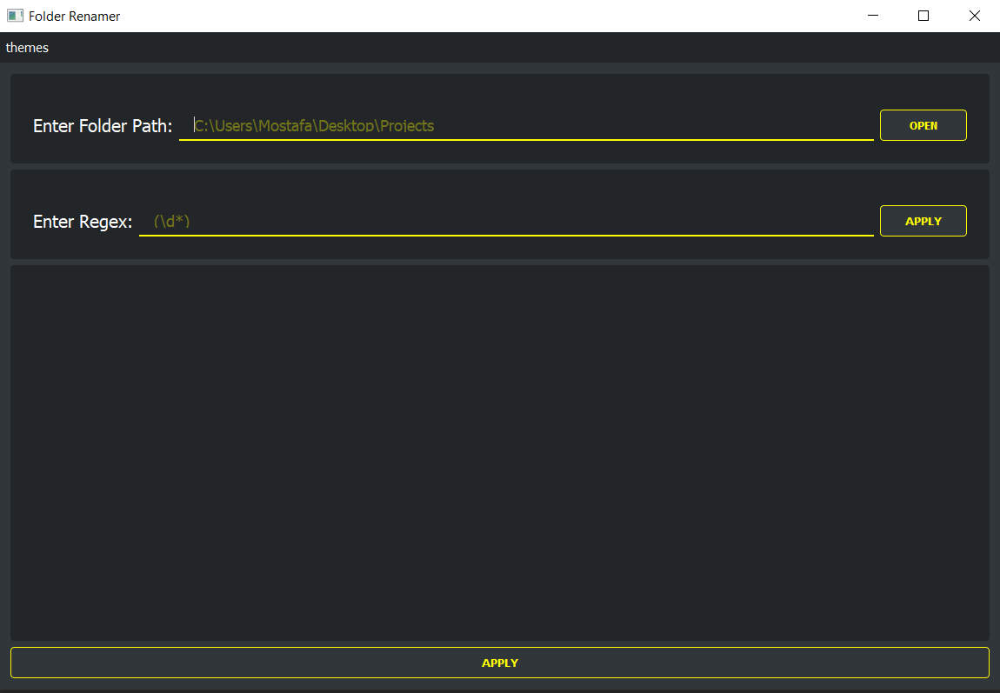

# Qt-file-renamer
## what is this ?
A program that changes the name of folders (written for a specific purpose)
##   Installing requirements
>`pip install requirements.txt`
##   Building from source
### Installing nuitka
#### from Pypi
>`pip install -U nuitka`
> Recommended
#### from source
>`pip install -U "https://github.com/Nuitka/Nuitka/archive/develop.zip"`
### 2. building executable file
>`python -m nuitka --follow-imports main.py`

# View

